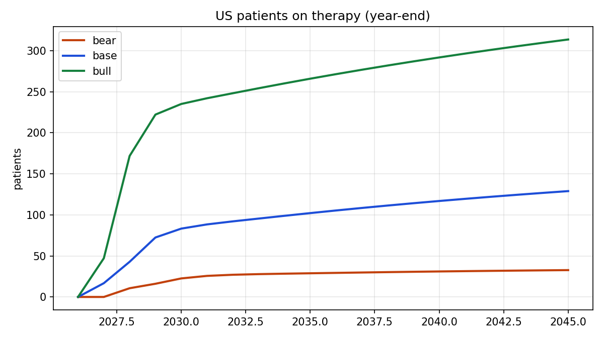
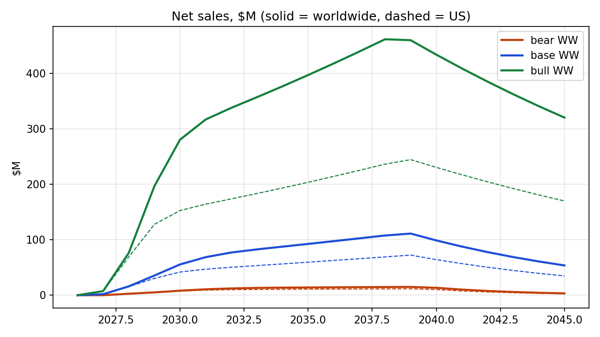
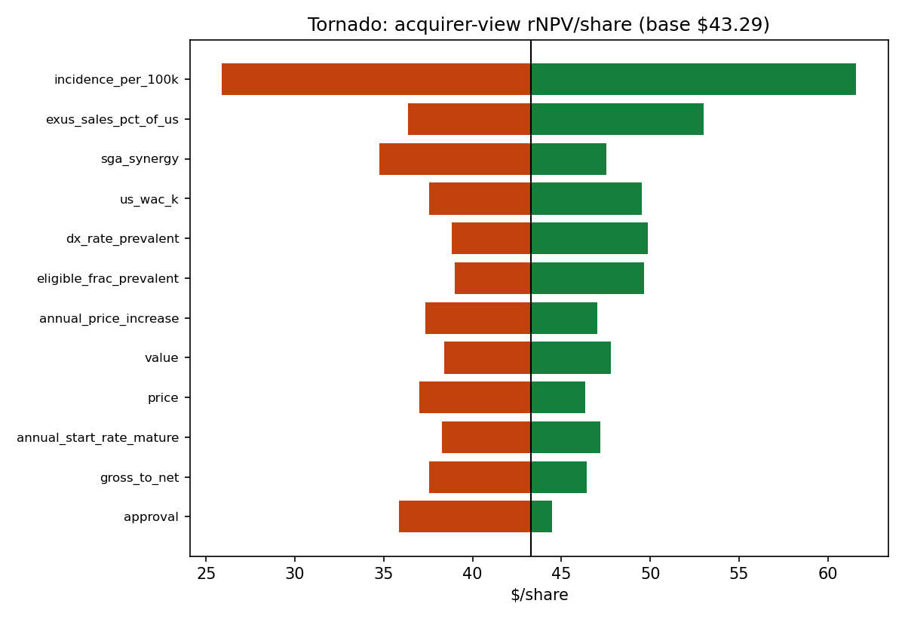

# SPRB model output

Valuation date 2026-09-16 · price $55.20 (2026-09-16) · generated by `python run.py` — do not edit by hand.

> Research artifact, not investment advice. Inputs tagged [assumption] in `inputs/*.yaml` drive everything.

## Cap table

| Item | Shares |
|---|---|
| Basic (10-Q cover, 8/10/26) | 2,874,013 |
| RSUs + options + ESPP (6/30/26) | 176,703 |
| Warrants/convert via TSM at $55.20 | 6,029 |
| **Fully diluted** | **3,056,745** |
| Fully diluted on change of control | 3,114,716 |

## What the market is pricing (base PoS / PRV)

|  | Value |
|---|---|
| Market cap (FD) | $169M |
| Cash (rolled to valuation date) − debt at face | $89M − $17M = $72M |
| Enterprise value | $97M |
| Risked after-tax PRV | $99M |
| **Implied value of TA-ERT** | **−$2M** |
| Implied WW peak sales at 3x | −$1M |
| Implied WW peak sales at 4x | −$1M |
| Implied WW peak sales at 5x | $0M |
| Implied WW peak sales at 6x | $0M |

## rNPV by scenario

Per share after the pre-approval raise, on FD shares. *Standalone* = Spruce commercializes alone; *acquirer* = a strategic owner strips G&A and part of SG&A from approval. Each branch is floored at $0 (limited liability) before probability-weighting.

| Scenario | Peak WW sales | Peak yr | Peak US pts | PoS | WACC | Success: standalone | Success: acquirer | Failure | rNPV standalone | rNPV acquirer | Low point of net cash, standalone success |
|---|---|---|---|---|---|---|---|---|---|---|---|
| bear | $15M | 2039 | 33 | 65% | 14% | $0.00 | $0.00 | $15.16 | **$5.31** | **$5.31** | −$901M (2045) |
| base | $111M | 2039 | 129 | 80% | 12% | $0.00 | $49.44 | $18.69 | **$3.74** | **$43.29** | −$255M (2045) |
| bull | $462M | 2038 | 314 | 90% | 10% | $293.28 | $381.78 | $18.59 | **$265.81** | **$345.46** | $48M (2026) |

Probability-weighted (25%/50%/25%): standalone **$69.65**, acquirer **$109.34** vs price $55.20.

A negative net-cash low point means the modeled raise is not enough — more dilution than modeled.

## EV / peak-sales grid ($/share)

(peak × multiple × (1 − 10% royalty haircut) × PoS 80% + risked after-tax PRV + net cash + raise) / 5,056,745 shares. Multiples are for an approved asset, so PoS is applied once.

| WW peak | 3x | 4x | 5x | 6x |
|---|---|---|---|---|
| $150M | $116.18 | $137.54 | $158.90 | $180.26 |
| $300M | $180.26 | $222.97 | $265.69 | $308.40 |
| $500M | $265.69 | $336.88 | $408.07 | $479.26 |
| $750M | $372.47 | $479.26 | $586.05 | $692.84 |

## Tornado (acquirer-view rNPV/share; each input to bear/bull, rest at base)

| Driver | Bear → Base → Bull input | At bear | At bull | Swing |
|---|---|---|---|---|
| epidemiology.incidence_per_100k | 0.21 → 0.36 → 0.52 | $25.88 | $61.59 | $35.71 |
| pricing.exus_sales_pct_of_us | 0.3 → 0.6 → 1.0 | $36.35 | $53.01 | $16.66 |
| company.acquirer_view.sga_synergy | 0.3 → 0.5 → 0.6 | $34.74 | $47.54 | $12.80 |
| pricing.us_wac_k | 650 → 750 → 850 | $37.55 | $49.53 | $11.98 |
| epidemiology.dx_rate_prevalent | 0.6 → 0.7 → 0.85 | $38.83 | $49.86 | $11.03 |
| epidemiology.eligible_frac_prevalent | 0.5 → 0.6 → 0.75 | $38.98 | $49.65 | $10.68 |
| pricing.annual_price_increase | 0.0 → 0.02 → 0.03 | $37.32 | $47.02 | $9.70 |
| deal_terms.prv.value | 120 → 160 → 200 | $38.40 | $47.80 | $9.39 |
| company.financing.pre_approval_raise.price | 35.0 → 50.0 → 60.0 | $37.01 | $46.34 | $9.33 |
| epidemiology.annual_start_rate_mature | 0.5 → 0.65 → 0.8 | $38.26 | $47.20 | $8.94 |
| pricing.gross_to_net | 0.35 → 0.25 → 0.2 | $37.55 | $46.42 | $8.87 |
| timeline.approval | 2028-01-01 → 2027-07-01 → 2027-05-15 | $35.84 | $44.49 | $8.65 |
| pricing.exus_mode | partner → direct → direct | $35.46 | $43.29 | $7.82 |
| timeline.probability_of_approval | 0.65 → 0.8 → 0.9 | $38.67 | $46.36 | $7.69 |
| epidemiology.untreated_life_years | 15 → 17 → 20 | $40.22 | $47.81 | $7.59 |
| timeline.discount_rate | 0.14 → 0.12 → 0.1 | $40.45 | $47.01 | $6.56 |
| epidemiology.years_on_therapy | 15 → 25 → 30 | $38.79 | $44.66 | $5.87 |
| epidemiology.eligible_frac_incident | 0.6 → 0.75 → 0.85 | $40.80 | $45.33 | $4.53 |
| epidemiology.start_ramp_years | 3.0 → 2.0 → 1.5 | $40.95 | $45.20 | $4.25 |
| timeline.post_loe_erosion | 0.25 → 0.15 → 0.1 | $41.30 | $44.98 | $3.68 |
| epidemiology.rollover_patients_at_launch | 8 → 12 → 16 | $41.49 | $45.07 | $3.58 |
| epidemiology.eligibility_loss_rate | 0.3 → 0.25 → 0.2 | $41.60 | $45.05 | $3.45 |
| company.operating_costs.cogs_pct | 0.15 → 0.12 → 0.1 | $41.46 | $44.50 | $3.04 |
| epidemiology.dx_rate_incident_mature | 0.7 → 0.85 → 0.95 | $41.49 | $44.44 | $2.95 |
| epidemiology.start_rate_at_launch | 0.2 → 0.3 → 0.4 | $42.19 | $44.36 | $2.17 |
| deal_terms.biomarin.royalty_tier_shift | 0.02 → 0.0 → -0.01 | $42.07 | $43.89 | $1.82 |
| timeline.exus_launch_lag_years | 2.0 → 1.5 → 1.0 | $42.67 | $43.71 | $1.04 |
| company.financing.pre_approval_raise.gross | 150 → 100 → 75 | $43.82 | $42.93 | $0.88 |
| epidemiology.years_to_mature_dx | 8 → 6 → 5 | $43.01 | $43.45 | $0.44 |

## Sensitivity: acquirer rNPV/share vs incidence × US WAC (base otherwise)

| Incidence /100k (US prevalent) | WAC $550k | WAC $650k | WAC $750k | WAC $850k | WAC $950k |
|---|---|---|---|---|---|
| 0.21 (~129) | $16.57 | $21.41 | $25.88 | $30.12 | $34.30 |
| 0.28 (~171) | $23.66 | $29.14 | $34.45 | $39.69 | $44.15 |
| 0.36 (~220) | $30.96 | $37.55 | $43.29 | $49.53 | $55.70 |
| 0.44 (~269) | $38.07 | $44.98 | $52.45 | $59.83 | $67.30 |
| 0.52 (~318) | $44.23 | $52.84 | $61.59 | $70.31 | $79.16 |

## Base case annual detail ($M; 2026 = rest of year)

| Line | 2026 | 2027 | 2028 | 2029 | 2030 | 2031 | 2032 | 2033 | 2034 | 2035 | 2036 | 2037 | 2040 | 2043 |
|---|---|---|---|---|---|---|---|---|---|---|---|---|---|---|
| WW net sales | 0.0 | 1.9 | 15.9 | 35.5 | 55.5 | 68.7 | 77.1 | 82.7 | 87.7 | 92.6 | 97.6 | 102.6 | 98.9 | 68.9 |
| Spruce revenue | 0.0 | 1.9 | 15.9 | 35.5 | 55.5 | 68.7 | 77.1 | 82.7 | 87.7 | 92.6 | 97.6 | 102.6 | 98.9 | 68.9 |
| COGS | 0.0 | 0.2 | 1.9 | 4.3 | 6.7 | 8.2 | 9.2 | 9.9 | 10.5 | 11.1 | 11.7 | 12.3 | 11.9 | 8.3 |
| BioMarin royalty | 0.0 | 0.1 | 1.3 | 2.8 | 4.4 | 5.5 | 6.2 | 6.6 | 7.0 | 7.4 | 7.8 | 8.3 | 7.9 | 5.5 |
| Reg. milestones | 0.0 | 25.5 | 0.0 | 0.0 | 0.0 | 0.0 | 0.0 | 0.0 | 0.0 | 0.0 | 0.0 | 0.0 | 0.0 | 0.0 |
| Sales milestones | 0.0 | 0.0 | 0.0 | 0.0 | 0.0 | 0.0 | 0.0 | 0.0 | 0.0 | 0.0 | 0.0 | 20.0 | 0.0 | 0.0 |
| R&D | 14.4 | 50.0 | 40.0 | 30.0 | 15.0 | 15.0 | 15.0 | 15.0 | 15.0 | 15.0 | 15.0 | 15.0 | 12.7 | 7.8 |
| G&A | 5.0 | 20.0 | 22.0 | 22.7 | 23.3 | 24.0 | 24.8 | 25.5 | 26.3 | 27.1 | 27.9 | 28.7 | 26.6 | 17.9 |
| US SG&A | 3.8 | 18.8 | 30.9 | 31.8 | 32.8 | 33.8 | 34.8 | 35.8 | 36.9 | 38.0 | 39.1 | 40.3 | 37.4 | 25.1 |
| Ex-US SG&A | 0.0 | 0.0 | 3.0 | 12.0 | 12.4 | 12.7 | 13.1 | 13.5 | 13.9 | 14.3 | 14.8 | 15.2 | 14.1 | 9.5 |
| PRV | 0.0 | 160.0 | 0.0 | 0.0 | 0.0 | 0.0 | 0.0 | 0.0 | 0.0 | 0.0 | 0.0 | 0.0 | 0.0 | 0.0 |
| Tax | 0.0 | 4.4 | 0.0 | 0.0 | 0.0 | 0.0 | 0.0 | 0.0 | 0.0 | 0.0 | 0.0 | 0.0 | 0.0 | 0.0 |
| FCF standalone | -23.2 | 42.8 | -83.2 | -68.1 | -39.1 | -30.6 | -26.0 | -23.7 | -22.0 | -20.3 | -18.7 | -37.2 | -11.8 | -5.2 |
| FCF acquirer | -23.2 | 53.3 | -44.2 | -23.5 | 5.4 | 13.2 | 17.9 | 20.9 | 23.5 | 26.0 | 28.5 | 15.3 | 32.1 | 23.7 |
| FCF if not approved | -23.2 | -52.2 | -0.0 | -0.0 | -0.0 | -0.0 | -0.0 | -0.0 | -0.0 | -0.0 | -0.0 | -0.0 | -0.0 | -0.0 |
